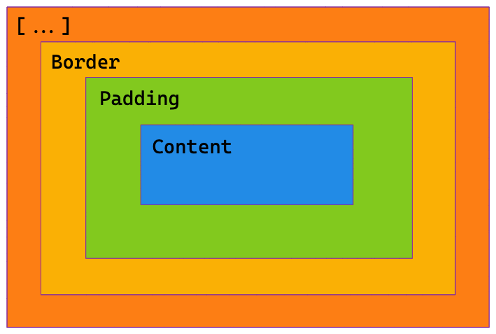
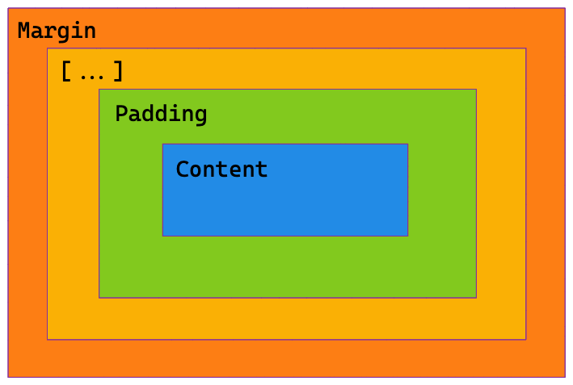
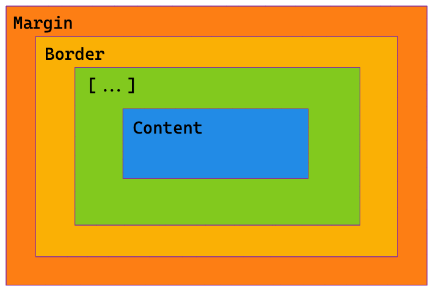
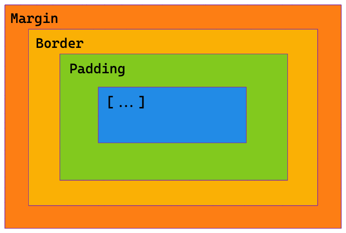

# css

<div markdown="block" data-question>
What is the property in the following css rule?

```css
p {
  margin: 32px;
}
```
</div>

`margin`

<div markdown="block" data-question>
What is the selector in the following css rule?

```css
p {
  margin: 32px;
}
```
</div>

`p`

## What is a css selector?

It is the part of a css rule that describes elements the rule will match.

<div markdown="block" data-question>
What is the first declaration in the following css rule?

```css
.code-snippet {
  padding: 32px;
  white-space: pre-wrap;
}
```
</div>

`padding: 32px;`


## What is a css declaration?

A css declaration is a property value pairing.

### Example

`padding: 32px;`

## What is a css rule?

A css selector and set of css declaration.

### Example

```css
div {
    border    : 1px solid black;
    font-size : 18px;
}
```

## How would you express a css media query to apply css rules when the window has a width between 0px and 300px?

Use `max-width: 300px`

```css
@media (max-width: 300px) {
  /* your rule */
}
```

## How would you express a css media query to apply css rules when the window has a width greater than 450px?

Use `min-width: 450px`

```css
@media (min-width: 450px) {
  /* your rule */
}
```

<div markdown="block" data-question>
What does the selector `div span` select in css?
</div>

All spans which have a div as an ancestor.


<div markdown="block" data-question>
Would the selector `div span` select the span in the following html?

```html
<div>
  <section>
    <span></span>
  </section>
</div>
```
</div>


Yes.

The selector selects all spans which have any ancestor (parent, parents parent, etc...) which is a div.

<div markdown="block" data-question>
How would you write a css selector to select the direct children `li` elements of a `ul` element?
</div>

`ul > li`

<div markdown="block" data-question>
Does the selection `ul > li` select the `li` in the following html?

```html
<ul>
  <div>
    <li></li>
  </div>
</ul>
```
</div>

No.

`li > ul` only selects `ul` elements which are a direct child of a `li` element.

## What is the difference between a css property that inherits and a css property that does not inherit?

A css property that inherits is applied to an element and the element's children.

A css property that does not inherit is not passed down to the element's children.

<div markdown="block" data-question>
What color will the paragraph text be given the following css stylesheet?

```css
p {
  color: black;
}

p {
  color: red;
}
```
</div>

## What is the clock trick for css short hands?

Many css short hands are specified in clockwise order `Top`, `Right`, `Bottom`, `Left`. You can picture these values being assigned in order around a clock.

## How does the css clock trick for css short hands deal with missing values?

Missing values are mirrored. If you specify `top` and `right` the `top` is mirrored to the bottom and the `right` is mirrored to the `left`. If you specify `top right bottom` only the `right` is mirrored to the left.

<div markdown="block" data-question>
## Which part of the box model is blank in the following image (1)?


</div>


Margin

<div markdown="block" data-question>
## Which part of the box model is blank in the following image (2)?


</div>

Border

<div markdown="block" data-question>
## Which part of the box model is blank in the following image (3)?


</div>

Padding

<div markdown="block" data-question>
## Which part of the box model is blank in the following image (4)?


</div>

Content

<div markdown="block" data-question>

## What are the dimensions of the box in the following example?

```html
<style>
  section {
    width: 500px;
  }
  .box {
    width: 100%;
    padding: 20px;
    border: 4px solid;
    box-sizing: content-box;
  }
</style>

<section>
  <div class="box"></div>
</section>
```
</div>

`548px x 48px`

Because the `.box` has `box-sizing: content-box` width refers to the box content and padding and border are added on top.
## What are the dimensions of the box in the following example?

```html
<style>
  section {
    width: 500px;
  }
  .box {
    width: 100%;
    padding: 20px;
    border: 4px solid;
    box-sizing: border-box;
  }
</style>

<section>
  <div class="box"></div>
</section>
```
</div>

`500px x 48px`

Because the `.box` has `box-sizing: border-box` width refers to the box content including padding and border.

## In css can borders or padding have negative values?

No

## In css can margins have negative values?

Yes

## In css how do you apply a margin that seeks to fill the maximum available space?

Using `margin: auto`

## In css how do you use margin to center an element?

Apply `margin-left: auto; margin-right: auto;` Both margins will seek to fill the maximum available space.