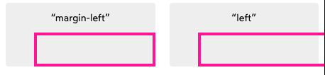

# css

<div markdown="block" data-question>
What is the property in the following css rule?

```css
p {
  margin: 32px;
}
```
</div>

`margin`

<div markdown="block" data-question>
What is the selector in the following css rule?

```css
p {
  margin: 32px;
}
```
</div>

`p`

## What is a css selector?

It is the part of a css rule that describes elements the rule will match.

<div markdown="block" data-question>
What is the first declaration in the following css rule?

```css
.code-snippet {
  padding: 32px;
  white-space: pre-wrap;
}
```
</div>

`padding: 32px;`


## What is a css declaration?

A css declaration is a property value pairing.

### Example

`padding: 32px;`

## What is a css rule?

A css selector and set of css declaration.

### Example

```css
div {
    border    : 1px solid black;
    font-size : 18px;
}
```

## How would you express a css media query to apply css rules when the window has a width between 0px and 300px?

Use `max-width: 300px`

```css
@media (max-width: 300px) {
  /* your rule */
}
```

## How would you express a css media query to apply css rules when the window has a width greater than 450px?

Use `min-width: 450px`

```css
@media (min-width: 450px) {
  /* your rule */
}
```

<div markdown="block" data-question>
What does the selector `div span` select in css?
</div>

All spans which have a div as an ancestor.


<div markdown="block" data-question>
Would the selector `div span` select the span in the following html?

```html
<div>
  <section>
    <span></span>
  </section>
</div>
```
</div>


Yes.

The selector selects all spans which have any ancestor (parent, parents parent, etc...) which is a div.

<div markdown="block" data-question>
How would you write a css selector to select the direct children `li` elements of a `ul` element?
</div>

`ul > li`

<div markdown="block" data-question>
Does the selection `ul > li` select the `li` in the following html?

```html
<ul>
  <div>
    <li></li>
  </div>
</ul>
```
</div>

No.

`li > ul` only selects `ul` elements which are a direct child of a `li` element.

## What is the difference between a css property that inherits and a css property that does not inherit?

A css property that inherits is applied to an element and the element's children.

A css property that does not inherit is not passed down to the element's children.

<div markdown="block" data-question>
What color will the paragraph text be given the following css stylesheet?

```css
p {
  color: black;
}

p {
  color: red;
}
```
</div>

red

## What is the clock trick for css short hands?

Many css short hands are specified in clockwise order `Top`, `Right`, `Bottom`, `Left`. You can picture these values being assigned in order around a clock.

## How does the css clock trick for css short hands deal with missing values?

Missing values are mirrored. If you specify `top` and `right` the `top` is mirrored to the bottom and the `right` is mirrored to the `left`. If you specify `top right bottom` only the `right` is mirrored to the left.

<div markdown="block" data-question>
## Which part of the box model is blank in the following image (1)?


</div>


Margin

<div markdown="block" data-question>
## Which part of the box model is blank in the following image (2)?


</div>

Border

<div markdown="block" data-question>
## Which part of the box model is blank in the following image (3)?


</div>

Padding

<div markdown="block" data-question>
## Which part of the box model is blank in the following image (4)?


</div>

Content

<div markdown="block" data-question>

## What are the dimensions of the box in the following example?

```html
<style>
  section {
    width: 500px;
  }
  .box {
    width: 100%;
    padding: 20px;
    border: 4px solid;
    box-sizing: content-box;
  }
</style>

<section>
  <div class="box"></div>
</section>
```
</div>

`548px x 48px`

Because the `.box` has `box-sizing: content-box` width refers to the box content and padding and border are added on top.

<div markdown="block" data-question>

## What are the dimensions of the box in the following example?

```html
<style>
  section {
    width: 500px;
  }
  .box {
    width: 100%;
    padding: 20px;
    border: 4px solid;
    box-sizing: border-box;
  }
</style>

<section>
  <div class="box"></div>
</section>
```
</div>

`500px x 48px`

Because the `.box` has `box-sizing: border-box` width refers to the box content including padding and border.

## In css can borders or padding have negative values?

No

## In css can margins have negative values?

Yes

## In css how do you apply a margin that seeks to fill the maximum available space?

Using `margin: auto`

## In css how do you use margin to center an element?

Apply `margin-left: auto; margin-right: auto;` Both margins will seek to fill the maximum available space.

## Can you give a width or height to an inline element in flow layout?

No


## Can you assign a margin left or margin right to an inline element in flow layout?

Yes

## In flow layout if two block elements have enough space to render side by side do they render side by side or do they stack vertically?

They stack vertically

## What causes extra space around inline elements if their padding, border, and margin are set to 0?

`line-height`

Inline elements are assumed to be typography and are granted extra space based on the `line-height` property.

<div markdown="block" data-question>
## What css property can be used to apply padding to each line of an inline element?

The default behavior


The desired behavior


</div>


`box-decoration-break: clone;`
## What is the default value of the css property `box-decoration-break`?

`slice`

## What is the main limitation of an `inline-block` element?

The inline block element cannot line-wrap.

## What is the difference between `width:auto` and `width:100%` in css?

Width auto fills the available space. Width 100% sets the width to the size of the parent element's content box.

## What does `width: min-content` do in css?

Make the element become as small as it can based on the child contents.

## What is the difference between an intrinsic and extrinsic value in css?

Intrinsic values are based on an element or an element's contents. Extrinsic values are based on an element's parent.

## Is `width: auto` an intrinsic or extrinsic value?

`extrinsic` -- width auto specifies that the width should dynamically fill the space *available in the parent element*.


## Is `width: min-content` an intrinsic or extrinsic value?

`intrinsic` -- min-content specifies that the width should collapse to as small as possible *based on the child contents*.

## What does `width: max-content` do in css?

Set the width to the smallest value that contains the content without line breaks even if this value is larger than the parent width.

## Is `width: max-content` an intrinsic or extrinsic value?

`intrinsic` -- max-content specifies that the width should expand to the point that there are no line breaks in the content even if this means expanding beyond the width of the parent.

## How does `width: fit-content` work in css?

If the width of the element's children is less than the width of the parent the width behaves like `width: max-content` and the width shrinks to the size of the content. If the width is larger than the available space in the parent the width adds line breaks to ensure it never exceeds the available space similar to `width: auto`


## How do width, min-width, and max-width interact in css?

The values are prioritized `min-width`, `max-width`, `width`.

If `max-width` is less than `min-width` then the element will use `min-width`.

<div markdown="block" data-question>

## Fill in the blanks in the algorithm css uses to calculate the width of an element


1. The browser calculates the width based on the {{c1::width}} value, ignoring {{c1::min-width}} and {{c1::max-width}}
2. If width is greater than max-width the browser recalculates width based on the {{c2::max-width}} value, ignoring {{c2::min-width}} and {{c2::width}}
3. If width is greater than min-width the browser recalculates width based on the {{c3::min-width}} value, ignoring {{c3::width}} and {{c3::max-width}}

</div>

## How can you replicate `width: fit-content` in IE11?

`display: table`

Display table causes an element to shrink to the size of it's contents but the element is still a block level element.

## What is the default height for an element in flow layout in css?

The element's height will shrink to the minimum height necessary to fit the element's content.


<div markdown="block" data-question>
## Why does height 100% on the following element not work?


```html
<style>
.wrapper {
  height: 100%;
}
</style>

<html>
<body>
<div class="wrapper">
</div>
</body>
</html>
```
</div>

Because the percentage height is based on the parent height and `body` does not have a height set which means it defaults to shrinking to contain it's children.

<div markdown="block" data-question>
## How can we make the div in the following example fill the entire page while allowing for the content to expand beyond the page height if necessary?


```html
<style>
.wrapper {
  height: 100%;
}
</style>

<html>
<body>
<div class="wrapper">
</div>
</body>
</html>
```
</div>

Add `height:100%` to `html` and `body` and `height: 100%` to `min-height: 100%` on the wrapper.

```html
<style>

html, body {
  height: 100%;
}

.wrapper {
  min-height: 100%;
}
</style>
```

When html has `height: 100%` it takes up the height of the viewport. The body will expand to fill the size of `html` and the `.wrapper` will expand to fill the size of `body` but grow larger than the body if the content fills more than a page.

## Do horizontal margins collapse in CSS?

No

## Do vertical margins collapse in CSS?

Yes

## What layout mode in css causes margins to collapse?

Flow layout

## List the layout modes in css which cause margins to collapse

Flow layout

<div markdown="block" data-question>
Given the following html what is the margin between the two paragraphs

```html
<style>
.top {
  margin: 24px;
}

.bottom {
  margin: 48px;
}
</style>
<p class="top">
Do sint cupidatat mollit qui pariatur minim aliquip culpa incididunt.
</p>
<p class="bottom">
Do sint cupidatat mollit qui pariatur minim aliquip culpa incididunt.
</p>
```
</div>


48px. The two margins collapse because they are adjacent and vertical but the larger margin wins.


<div markdown="block" data-question>
Given the following html what is the margin between the two paragraphs

```html
<style>
.top {
  margin: 24px;
}

.bottom {
  margin: 48px;
}
</style>
<p class="top">
Do sint cupidatat mollit qui pariatur minim aliquip culpa incididunt.
</p>
<br/>
<p class="bottom">
Do sint cupidatat mollit qui pariatur minim aliquip culpa incididunt.
</p>
```
</div>

72px (48 + 24).

Margin only collapses for adjacent html elements.
Because of the `br` tag the paragraph tags are no longer adjacent

<div markdown="block" data-question>
Given the following html what is the margin between the two paragraphs

```html
<style>
  p {
    margin-top: 48px;
    margin-bottom: 48px;
  }
</style>
<div>
  <p>Paragraph One</p>
</div>
<p>Paragraph Two</p>
```
</div>

48px. The margins collapse because the margins are touching even though one margin is inside a div.

<div markdown="block" data-question>
Given the following html what is the margin between the two paragraphs

```html
<style>
  p {
    margin-top: 48px;
    margin-bottom: 48px;
  }
  div {
    padding: 2px;
  }
</style>
<div>
  <p>Paragraph One</p>
</div>
<p>Paragraph Two</p>
```
</div>

98px. (48 + 2 + 48). The margins are no longer touching because there is padding between the margins so the margins do not collapse.


<div markdown="block" data-question>

## Fill in the blanks for the following margin collapse rule

Margins must be {{c1::touching}} in order for them to {{c2:collapse}}

</div>


<div markdown="block" data-question>

## Fill in the blanks for the following margin collapse rule

A {{c1::parent}} and {{c1::child}} can combine margins in the same direction

</div>

<div markdown="block" data-question>
Given the following html what is the margin between the two paragraphs

```html
<style>
  p {
    margin-top: -72px;
    margin-bottom: -48px;
  }
</style>
<div>
  <p>Paragraph One</p>
</div>
<p>Paragraph Two</p>
```
</div>

-72px. The margins both share the same space and the smaller negative margin is absorbed into the larger negative margin. 

<div markdown="block" data-question>
Given the following html what is the margin between the two paragraphs

```html
<style>
  p {
    margin-top: -72px;
    margin-bottom: 72px;
  }
</style>
<div>
  <p>Paragraph One</p>
</div>
<p>Paragraph Two</p>
```
</div>

0px. The margins share the same space but they are added together and cancel each other out.

<div markdown="block" data-question>
## Fill in the algorithm for margin collapse with negative and positive margins.

- Find the {{c1::largest positive margin}}
- Find the {{c2::most negative negative margin}}
- {{c3::Add those two numbers together}}
</div>

## What is the default position value in css?


Static.

```css
* {
  position: static;
}
```

## What css properties are ignored on an element with position static?

`top`, `left`, `right`, `bottom`

## How is shifting an element with `position: relative` different from shifting an element with `position: static; margin: ...` with regard to layout?

Shifting an element with `position: relative` does not impact layout.
The browser acts like the element is in its original position.

## How is shifting an element with `position: relative` different from shifting an element with `position: static; margin: ...` with regard to dimensions?

Shifting an element with `position: relative` does not impact the dimensions of the element.
Changing the margin might impact the dimensions of the element.



## Can position relative be applied to inline elements?

Yes

## Can position relative be applied to block elements?

Yes

## How does an element with `position: absolute` effect the layout of other elements?

Elements with position absolute are pulled out of flow and do not effect the layout of the other elements.

## What is the default layout location for an element with `position: absolute`?

The element will be placed in it's natural position as if it had `position: static` but will not effect the flow of other elements.

<div markdown="block" data-question>
## Describe how the following paragraphs will be rendered.

```html
<style>
p {
  position: absolute;
}
</style>

<p>This is a paragraph.</p>
<p>Another paragraph, with different words.</p>
<p>Finally, to complete the set, a third.</p>
```

</div>

The paragraphs will be rendered one on top of the next.
The first paragraph is rendered in it's natural position and taken out of flow, then the second paragraph is rendered in it's natural position which is the same as the first since the first paragraph has been taken out of flow. 

This pattern repeats for each subsequent paragraph.


## How does `position: absolute` change the width of block elements?

Block elements with position absolute will shrink to the smallest size which fits their contents. If the content is larger than the parent element then the content will line wrap. If the content cannot be line wrapped the content will spill out beyond the parent's content box.
