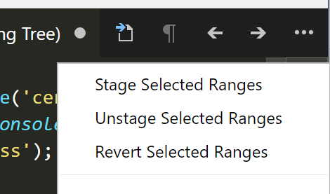

# Vscode

## In vscode how do you stage some changes of a file but not others?

- open the git comparison of the fille
- Select the lines you want to stage.
- Click '...' then Stage Selected Ranges.

Alternatively you can select the lines you want to stage and use the keyboard shortcut.

`[CMD + K    ALT + CMD + S]`
